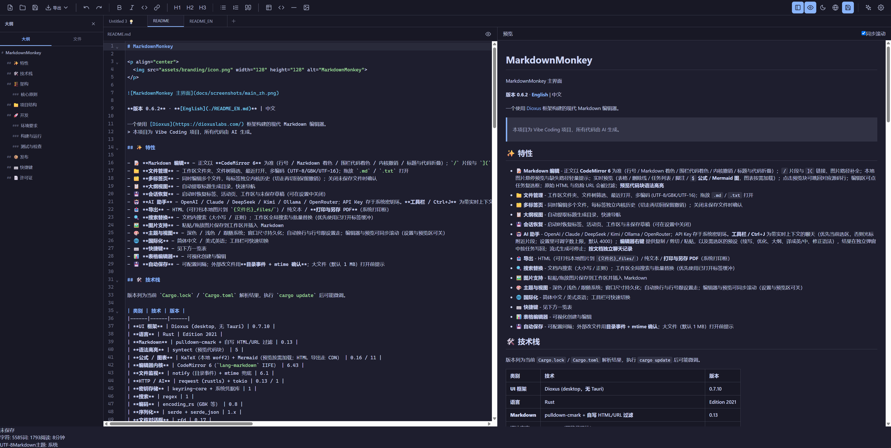

# MarkdownMonkey



**版本 0.5.1** · **[English](./README_EN.md)** | 中文

一个使用 [Dioxus](https://dioxuslabs.com/) 框架构建的现代 Markdown 编辑器。
> 本项目为 Vibe Coding 项目，所有代码由 AI 生成。

## ✨ 特性

- 📝 **Markdown 编辑** - 正文以 **CodeMirror 5** 为准（行号 / Markdown 着色 / 内核撤销）；实时预览（表格 / 删除线 / 任务列表 / 脚注 / **`$` 公式** / **Mermaid 图**，图表按需加载）；点击预览块可跳回对应源码行；原始 HTML 与危险 URL 会被过滤；**预览代码块语法高亮**
- 📁 **文件管理** - 工作区文件夹、文件树筛选、最近打开、多编码 (UTF-8/GBK/UTF-16)；拖放 `.md` / `.txt` 打开
- 🗂️ **多标签页** - 同时编辑多个文件，每标签独立历史；关闭未保存文件时确认
- 📋 **大纲视图** - 自动提取标题生成目录，快速导航
- 💾 **会话恢复** - 启动时恢复标签、活动页、工作区与未保存草稿（可在设置中关闭）
- 🤖 **AI 助手** - OpenAI / Claude / DeepSeek / Kimi / Ollama / OpenRouter；流式生成可停止；**按文档独立会话历史**；API Key 存于系统密钥环
- 📤 **导出** - HTML（可打包本地图片到 `{文件名}_files/`）/ 纯文本 / **打印与另存 PDF**（系统打印框）
- 🔍 **搜索替换** - 文档内搜索（大小写 / 正则）；工作区全局搜索与批量替换（优先使用已打开标签缓冲）
- 🖼️ **图片支持** - 粘贴/拖放图片保存到工作区并插入 Markdown
- 🎨 **主题与视图** - 深色 / 浅色 / 跟随系统；窗口尺寸持久化；编辑器与预览可同步滚动（设置与预览区可关）
- 🌐 **国际化** - 简体中文 / 美式英语；工具栏可快速切换
- ⌨️ **快捷键** - 见下方一览表
- 📊 **表格编辑器** - 可视化创建与编辑
- 💾 **自动保存** - 可配置间隔；外部改文件用**目录事件 + mtime 确认**；大文件（默认 1 MB）打开前提示

## 🛠️ 技术栈

版本列为当前 `Cargo.lock` / `Cargo.toml` 解析结果，执行 `cargo update` 后可能微调。

| 类别 | 技术 | 版本 |
|------|------|------|
| **UI 框架** | Dioxus (desktop，无 Tauri) | 0.7.10 |
| **语言** | Rust | Edition 2021 |
| **Markdown** | pulldown-cmark + 自写 HTML/URL 过滤 | 0.13 |
| **语法高亮** | syntect（预览代码块） | 5 |
| **公式 / 图表** | KaTeX（本地 woff2）+ Mermaid（预览按需加载；HTML 导出走 CDN） | 0.16 / 11 |
| **编辑器内核** | CodeMirror 5（Markdown 模式） | 5.65 |
| **文件监视** | notify（目录事件）+ mtime 兜底 | 6.1 |
| **HTTP / AI** | reqwest (rustls) + tokio | 0.13 / 1 |
| **密钥存储** | keyring-core + 系统凭据库 | 1 |
| **搜索** | regex | 1 |
| **编码** | encoding_rs（GBK 等） | 0.8 |
| **序列化** | serde + serde_json | 1.x |
| **文件对话框** | rfd | 0.17 |
| **日志** | tracing + tracing-subscriber | 0.1 / 0.3 |

## 🏗️ 架构

项目以 **组件 + Actions + Services/State** 分层，采用 PAL (Presentation-Actions-Logic) 启发式架构。

组件通过 Dioxus Signal **读取** `AppState` 以驱动界面；所有对 `AppState` 的 **写入** 都走 Actions。文件树筛选、模型下拉、表格草稿等组件内 `use_signal` 仍留在 UI 层，不进入全局状态。

```
┌─────────────────────────────────────────────────┐
│  Presentation (展示层)                           │
│  components/ — 只读 AppState，负责渲染           │
│  ├── editor.rs, preview.rs, sidebar.rs          │
│  ├── toolbar.rs, tabbar.rs, statusbar.rs        │
│  └── *_modal.rs（设置、搜索、AI、表格、确认等）    │
├─────────────────────────────────────────────────┤
│  Actions (动作层) — 唯一写入 AppState 的入口      │
│  ├── app_actions.rs — 主题、语言、侧边栏、AI 流   │
│  ├── editor_actions.rs — 编辑、格式、同步滚动、打印 │
│  ├── file_actions.rs — 打开 / 保存 / 标签         │
│  ├── search_actions.rs — 文档内与工作区搜索       │
│  ├── settings_actions.rs — 设置与密钥环           │
│  └── shortcut_actions.rs — 快捷键分发             │
├─────────────────────────────────────────────────┤
│  Logic (逻辑层)                                  │
│  state/ — AppState（Dioxus Signal）              │
│  services/ — 可独立测试的纯逻辑（Markdown、导出、  │
│              会话、目录事件监视、密钥环）          │
│  utils/ — i18n、编码、路径、工作区搜索、替换      │
└─────────────────────────────────────────────────┘
```

### 核心原则

1. 所有 Hooks 在组件顶部无条件调用
2. 始终渲染所有子组件，用 CSS 控制显示
3. 组件只读 `AppState`，写入经 Actions；局部 UI 草稿可留在组件内
4. 状态管理使用 Dioxus Signal 响应式模式

## 📁 项目结构

```
src/
├── main.rs                 # 应用入口（Dioxus Desktop，无 Tauri）
├── app.rs                  # 主布局、初始化、自动保存、会话恢复、文件监控
├── config.rs               # 运行时阈值与默认值
│
├── state/
│   ├── types.rs            # Theme、TabInfo、History 等类型
│   ├── domains.rs          # 按领域拆分的状态视图
│   ├── app_state.rs        # AppState 结构与初始化
│   ├── app_state_ops.rs    # 文档 / 标签 / 大纲业务逻辑
│   └── app_state_tests.rs  # 状态单元测试
│
├── components/             # UI 组件（读 Signal，写走 Actions）
│   ├── editor.rs / preview.rs / sidebar.rs / toolbar.rs
│   ├── tabbar.rs / statusbar.rs / file_tree.rs / icons.rs
│   └── *_modal.rs          # 设置、搜索、AI、表格、确认、快捷键
│
├── actions/                # 交互逻辑（AppState 写入）
│   ├── app_actions.rs / editor_actions.rs / file_actions.rs
│   ├── search_actions.rs / settings_actions.rs
│   ├── shortcut_actions.rs
│   └── tests.rs
│
├── services/
│   ├── markdown.rs / highlight.rs / ai.rs / auto_save.rs / image.rs
│   ├── settings.rs / session.rs / recent_files.rs
│   ├── file_watcher.rs     # 目录事件 + mtime 确认
│   ├── katex_css.rs        # 打包 KaTeX woff2 的样式改写
│   ├── keyring_service.rs / theme_detector.rs
│   └── export/             # HTML / 纯文本 / 打印文档
│       ├── mod.rs / shared.rs
│       ├── html.rs / text.rs
│
├── utils/
│   ├── i18n.rs / file_utils.rs / file_encoding.rs
│   ├── paths.rs / clipboard.rs
│   ├── workspace_search.rs # 工作区搜索（含打开标签缓冲）
│   └── replace.rs          # 替换工具
│
└── styles/                 # CSS（variables / base / editor / syntax / toolbar / sidebar / modals）

assets/
├── editor_enhance.js       # textarea 桥（内核未挂上时的回退）
├── editor_codemirror.js    # CodeMirror 5 升级与 Rust 桥
├── preview_enhance.js      # 预览 KaTeX；Mermaid 按需加载
├── print.js                # 隐藏 iframe 调系统打印框
└── vendor/                 # CodeMirror / KaTeX(+fonts) / Mermaid

packaging/                  # Windows Inno Setup / Linux .deb / macOS Info.plist
docs/                       # 发布说明、验收清单、README 截图
```

配置与会话数据默认位于用户配置目录下的 `MarkdownMonkey/`（`settings.json`、`session.json`、`session_drafts/`、`ai_history/`）：

- Windows：`%APPDATA%\MarkdownMonkey`
- macOS：`~/Library/Application Support/MarkdownMonkey`
- Linux：`$XDG_CONFIG_HOME/MarkdownMonkey` 或 `~/.config/MarkdownMonkey`

## 🚀 开发

### 环境要求

- Rust **1.88+**（CI 使用 `stable`；源码使用 `slice::as_chunks`）
- Cargo

### 构建与运行

```bash
cargo build
cargo build --release
cargo run
```

调试日志示例（Windows PowerShell）：

```powershell
$env:RUST_LOG="markdownmonkey=debug,info"; cargo run
```

Unix-like：

```bash
RUST_LOG=markdownmonkey=debug,info cargo run
```

### 测试与检查

与 CI（`.github/workflows/ci.yml`）一致：

```bash
cargo fmt --all -- --check
cargo clippy --all-targets -- -D warnings
cargo test --all-targets
```

## 📦 发布

跨平台打包与打标签流程见 **[docs/RELEASE.md](docs/RELEASE.md)**（GitHub Actions：Windows zip + Setup.exe / Linux tar.gz + .deb / macOS `.app`）。打 `v0.5.1` 前请按 **[docs/RELEASE_CHECKLIST.md](docs/RELEASE_CHECKLIST.md)** 验收。

## ⌨️ 快捷键

macOS 使用 ⌘（Command），Windows / Linux 使用 Ctrl。

| 快捷键 | 功能 |
|--------|------|
| Ctrl/⌘+N | 新建文件 |
| Ctrl/⌘+O | 打开文件 |
| Ctrl/⌘+S | 保存 |
| Ctrl/⌘+Z | 撤销 |
| Ctrl/⌘+Y / Ctrl/⌘+Shift+Z | 重做 |
| Ctrl/⌘+B | 粗体 |
| Ctrl/⌘+I | 斜体 |
| Ctrl/⌘+` | 行内代码 |
| Ctrl/⌘+K | 插入链接 |
| Ctrl/⌘+F | 文档内搜索替换 |
| Ctrl/⌘+Shift+F | 工作区全局搜索 / 替换 |
| Ctrl/⌘+Shift+P | 打印 / 另存 PDF |
| Ctrl/⌘+\\ | 切换侧边栏 |
| Ctrl/⌘+P | 切换预览 |
| Ctrl/⌘+T | 切换主题 |
| Ctrl/⌘+, | 打开设置 |
| Ctrl/⌘+/ | 显示快捷键 |
| Ctrl/⌘+J | AI 助手 |
| Escape | 关闭弹窗 |

## 📄 许可证

MIT License（见仓库根目录 [LICENSE](./LICENSE)）
