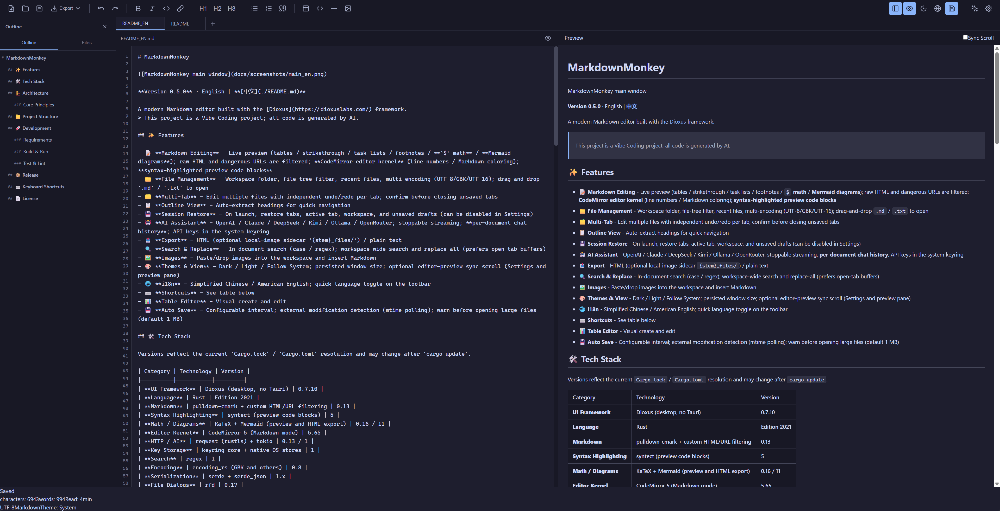

# MarkdownMonkey



**Version 0.6.0** · English | **[中文](./README.md)**

A modern Markdown editor built with the [Dioxus](https://dioxuslabs.com/) framework.
> This project is a Vibe Coding project; all code is generated by AI.

## ✨ Features

- 📝 **Markdown Editing** - **CodeMirror 6** is the source of truth (line numbers / Markdown coloring / kernel undo); live preview (tables / strikethrough / task lists / footnotes / **`$` math** / **Mermaid**, loaded on demand); click a preview block to jump to its source line; raw HTML and dangerous URLs are filtered; **syntax-highlighted preview code blocks**
- 📁 **File Management** - Workspace folder, file-tree filter, recent files, multi-encoding (UTF-8/GBK/UTF-16); drag-and-drop `.md` / `.txt` to open
- 🗂️ **Multi-Tab** - Edit multiple files with independent history per tab; confirm before closing unsaved tabs
- 📋 **Outline View** - Auto-extract headings for quick navigation
- 💾 **Session Restore** - On launch, restore tabs, active tab, workspace, and unsaved drafts (can be disabled in Settings)
- 🤖 **AI Assistant** - OpenAI / Claude / DeepSeek / Kimi / Ollama / OpenRouter; stoppable streaming; **per-document chat history**; API keys in the system keyring
- 📤 **Export** - HTML (optional local-image sidecar `{stem}_files/`) / plain text / **print and Save as PDF** (system print dialog)
- 🔍 **Search & Replace** - In-document search (case / regex); workspace-wide search and replace-all (prefers open-tab buffers)
- 🖼️ **Images** - Paste/drop images into the workspace and insert Markdown
- 🎨 **Themes & View** - Dark / Light / Follow System; persisted window size; optional editor–preview sync scroll (Settings and preview pane)
- 🌐 **i18n** - Simplified Chinese / American English; quick language toggle on the toolbar
- ⌨️ **Shortcuts** - See table below
- 📊 **Table Editor** - Visual create and edit
- 💾 **Auto Save** - Configurable interval; external edits use **directory events + mtime confirmation**; warn before opening large files (default 1 MB)

## 🛠️ Tech Stack

Versions reflect the current `Cargo.lock` / `Cargo.toml` resolution and may change after `cargo update`.

| Category | Technology | Version |
|----------|-----------|---------|
| **UI Framework** | Dioxus (desktop, no Tauri) | 0.7.10 |
| **Language** | Rust | Edition 2021 |
| **Markdown** | pulldown-cmark + custom HTML/URL filtering | 0.13 |
| **Syntax Highlighting** | syntect (preview code blocks) | 5 |
| **Math / Diagrams** | KaTeX (bundled woff2) + Mermaid (lazy in preview; CDN in HTML export) | 0.16 / 11 |
| **Editor Kernel** | CodeMirror 6 (`lang-markdown` IIFE) | 6.43 |
| **File Watch** | notify (directory events) + mtime fallback | 6.1 |
| **HTTP / AI** | reqwest (rustls) + tokio | 0.13 / 1 |
| **Key Storage** | keyring-core + native OS stores | 1 |
| **Search** | regex | 1 |
| **Encoding** | encoding_rs (GBK and others) | 0.8 |
| **Serialization** | serde + serde_json | 1.x |
| **File Dialogs** | rfd | 0.17 |
| **Logging** | tracing + tracing-subscriber | 0.1 / 0.3 |

## 🏗️ Architecture

Organized as **Components + Actions + Services/State**, following a PAL (Presentation-Actions-Logic) inspired layout.

Components **read** `AppState` through Dioxus Signals to drive the UI; all **writes** to `AppState` go through Actions. Component-local `use_signal` values (file-tree filter, model dropdown, table drafts) stay in the UI layer.

```
┌─────────────────────────────────────────────────┐
│  Presentation                                   │
│  components/ — read-only AppState, render UI    │
│  ├── editor.rs, preview.rs, sidebar.rs          │
│  ├── toolbar.rs, tabbar.rs, statusbar.rs        │
│  └── *_modal.rs (settings, search, AI, table, …)│
├─────────────────────────────────────────────────┤
│  Actions — the only AppState write entry        │
│  ├── app_actions.rs — theme, language, sidebar, AI stream │
│  ├── editor_actions.rs — edit, format, sync scroll, print │
│  ├── file_actions.rs — open / save / tabs                 │
│  ├── search_actions.rs — in-document and workspace search │
│  ├── settings_actions.rs — settings and keyring           │
│  └── shortcut_actions.rs — shortcut dispatch              │
├─────────────────────────────────────────────────┤
│  Logic                                          │
│  state/ — AppState (Dioxus Signal)              │
│  services/ — testable logic (Markdown, export,  │
│              session, directory watcher, keyring)│
│  utils/ — i18n, encoding, paths, search, replace│
└─────────────────────────────────────────────────┘
```

### Core Principles

1. All hooks are called unconditionally at the top of components
2. Always render all sub-components; control visibility with CSS
3. Components read `AppState`; writes go through Actions; local UI drafts may stay in the component
4. State management uses the Dioxus Signal reactive pattern

## 📁 Project Structure

```
src/
├── main.rs                 # Application entry (Dioxus Desktop, no Tauri)
├── app.rs                  # Layout, init, auto-save, session restore, file watching
├── config.rs               # Runtime thresholds and defaults
│
├── state/
│   ├── types.rs            # Theme, TabInfo, History, etc.
│   ├── domains.rs          # Domain-scoped state views
│   ├── app_state.rs        # AppState struct and initialization
│   ├── app_state_ops.rs    # Document / tabs / outline logic
│   └── app_state_tests.rs  # State unit tests
│
├── components/             # UI (read Signals, write via Actions)
│   ├── editor.rs / preview.rs / sidebar.rs / toolbar.rs
│   ├── tabbar.rs / statusbar.rs / file_tree.rs / icons.rs
│   └── *_modal.rs          # Settings, search, AI, table, confirms, shortcuts
│
├── actions/                # Interaction logic (AppState writes)
│   ├── app_actions.rs / editor_actions.rs / file_actions.rs
│   ├── search_actions.rs / settings_actions.rs
│   ├── shortcut_actions.rs
│   └── tests.rs
│
├── services/
│   ├── markdown.rs / highlight.rs / ai.rs / auto_save.rs / image.rs
│   ├── settings.rs / session.rs / recent_files.rs
│   ├── file_watcher.rs     # directory events + mtime confirm
│   ├── katex_css.rs        # rewrite KaTeX CSS onto bundled woff2
│   ├── keyring_service.rs / theme_detector.rs
│   └── export/             # HTML / plain text / print document
│       ├── mod.rs / shared.rs
│       ├── html.rs / text.rs
│
├── utils/
│   ├── i18n.rs / file_utils.rs / file_encoding.rs
│   ├── paths.rs / clipboard.rs
│   ├── workspace_search.rs # Workspace search (open-tab buffers)
│   └── replace.rs          # Replace helpers
│
└── styles/                 # CSS (variables / base / editor / syntax / toolbar / sidebar / modals)

assets/
├── editor_enhance.js       # textarea bridge (fallback if the kernel is not mounted)
├── editor_codemirror.js    # CodeMirror 6 upgrade and Rust bridge
├── preview_enhance.js      # preview KaTeX; Mermaid loaded on demand
├── print.js                # hidden iframe → system print dialog
└── vendor/                 # vendored CodeMirror 6 IIFE / KaTeX(+fonts) / Mermaid

scripts/codemirror/         # one-shot esbuild to rebuild the vendor IIFE (CI does not run npm)
packaging/                  # Windows Inno Setup / Linux .deb / macOS Info.plist
docs/                       # release guide, checklist, README screenshots
```

Settings and session data live under the user config directory in `MarkdownMonkey/` (`settings.json`, `session.json`, `session_drafts/`, `ai_history/`):

- Windows: `%APPDATA%\MarkdownMonkey`
- macOS: `~/Library/Application Support/MarkdownMonkey`
- Linux: `$XDG_CONFIG_HOME/MarkdownMonkey` or `~/.config/MarkdownMonkey`

## 🚀 Development

### Requirements

- Rust **1.88+** (CI uses `stable`; the source uses `slice::as_chunks`)
- Cargo

### Build & Run

```bash
cargo build
cargo build --release
cargo run
```

Verbose logging (Windows PowerShell):

```powershell
$env:RUST_LOG="markdownmonkey=debug,info"; cargo run
```

Unix-like:

```bash
RUST_LOG=markdownmonkey=debug,info cargo run
```

### Test & Lint

Same as CI (`.github/workflows/ci.yml`):

```bash
cargo fmt --all -- --check
cargo clippy --all-targets -- -D warnings
cargo test --all-targets
```

## 📦 Release

Cross-platform packaging and tagging are documented in **[docs/RELEASE.md](docs/RELEASE.md)** (GitHub Actions: Windows zip + Setup.exe / Linux tar.gz + .deb / macOS `.app`). Complete **[docs/RELEASE_CHECKLIST.md](docs/RELEASE_CHECKLIST.md)** before tagging `v0.6.0`.

## ⌨️ Keyboard Shortcuts

macOS uses ⌘ (Command); Windows / Linux use Ctrl.

| Shortcut | Action |
|----------|--------|
| Ctrl/⌘+N | New File |
| Ctrl/⌘+O | Open File |
| Ctrl/⌘+S | Save |
| Ctrl/⌘+Z | Undo |
| Ctrl/⌘+Y / Ctrl/⌘+Shift+Z | Redo |
| Ctrl/⌘+B | Bold |
| Ctrl/⌘+I | Italic |
| Ctrl/⌘+` | Inline Code |
| Ctrl/⌘+K | Insert Link |
| Ctrl/⌘+F | In-document Search & Replace |
| Ctrl/⌘+Shift+F | Workspace Search / Replace |
| Ctrl/⌘+Shift+P | Print / Save as PDF |
| Ctrl/⌘+\\ | Toggle Sidebar |
| Ctrl/⌘+P | Toggle Preview |
| Ctrl/⌘+T | Toggle Theme |
| Ctrl/⌘+, | Open Settings |
| Ctrl/⌘+/ | Show Shortcuts |
| Ctrl/⌘+J | AI Assistant |
| Escape | Close Modal |

## 📄 License

MIT License (see [LICENSE](./LICENSE) in the repository root)
